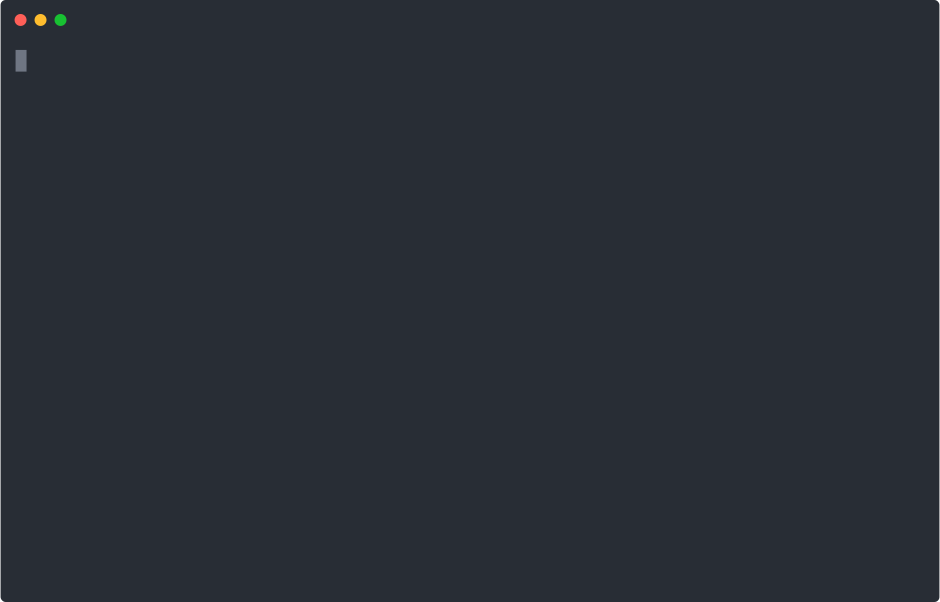

- [Installatie](#installatie)
- [Breakpoints](#breakpoints)
- [Stepping](#stepping)
- [Variabelen printen](#variabelen-printen)
- [Stack frames inspecteren](#stack-frames-inspecteren)
- [Verschillende CPUs inspecteren](#verschillende-cpus-inspecteren)

# Installatie

Om xv6 te debuggen, zullen we gebruik maken van [GDB][gdb].
Helaas is er heeft Ubuntu standaard geen packages voor de RISC-V versie van GDB en zullen we deze handmatig moeten installeren.
Download daarvoor het bestand `gdb-riscv64-unknown-elf_10.1-1_amd64.deb` ([link](https://github.com/besturingssystemen/utilities/raw/master/gdb-riscv64-unknown-elf_10.1-1_amd64.deb)).

```shell
cd Downloads
sudo dpkg -i gdb-riscv64-unknown-elf_10.1-1_amd64.deb
```

Als je geen foutmeldingen kreeg, zou de RISC-V versie van GDB nu geïnstalleerd moeten zijn.
Check dit met het volgende commando:

```shell
riscv64-unknown-elf-gdb -v
```

Als alles goed is gegaan, zou dit onder andere het volgende moeten printen: "GNU gdb (GDB) 10.1".

Voor nu het volgende commando uit om GDB te configureren:

```shell
echo "set auto-load safe-path /" > ~/.gdbinit
```

Ga nu weer naar de `xv6-riscv` directory in een terminal en voer het volgende commando uit:

```shell
make qemu-gdb
```

Dit start xv6 met ondersteuning voor het gebruik van GDB.
De kernel begint niet uit te voeren voordat we er een debugger aan verbinden.
Open hiervoor een andere terminal en ga daarin ook naar de `xv6-riscv` directory.
Start de debugger nu:

```shell
riscv64-unknown-elf-gdb
```

De output zou er als volgt moeten uitzien (`...` betekent oninteressante output):
<pre>
GNU gdb (GDB) 10.1
...
0x0000000000001000 in ?? ()
(gdb)
</pre>

We kunnen nu commando's ingeven achter de `(gdb)`-prompt.

# Breakpoints

Een _breakpoint_ kan gebruikt worden om GDB automatisch te laten stoppen wanneer er een bepaald punt in het programma bereikt wordt.
Wanneer GDB stopt, kan je weer commando's ingeven in de prompt.

Er zijn meerdere manieren om de locatie van een breakpoint te geven via het `break` (`b`) commando:
- `break symbol`: Zet een breakpoint wanneer het geven `symbol` (de naam van een functie) bereikt wordt.
  Bijvoorbeeld: `break kalloc`.
- `break filename:linenum`. Zet een breakpoint op een bepaalde lijn in een file.
  Bijvoorbeeld: `break kernel/exec.c:52`.

Je kan meerdere breakpoints tegelijkertijd zetten en GDB zal stoppen wanneer één van de breakpoint bereikt word.
Nog een aantal handige commando's:
- `info breakpoints`: Toon alle breakpoints.
  Elke breakpoint heeft een identifier (`Num`) waarmee je ernaar kan verwijzen in andere commando's.
- `enable/disable num`: Zet een breakpoint tijdelijk aan of uit.
- `delete num`. Verwijder een breakpoint permanent.

Als je klaar bent met het inspecteren van het programma tijdens een breakpoint, kan je de uitvoering verderzetten met `continue` (`c`).
GDB zal dan uitvoeren tot aan het volgende breakpoint.

Je kan GDB op elk moment handmatig stoppen door <kbd>CTRL</kbd>+<kbd>C</kbd> te typen.

[](https://asciinema.org/a/376454)

# Stepping

In plaats van het programma verder te laten uitvoeren tot het volgende breakpoint met `continue`, kan je het ook in kleinere stappen laten uitvoeren:
- `step` (`s`): Voer uit tot de volgende regel C-code.
  Dit zal functie oproepen binnengaan.
- `next` (`n`): Voor uit tot de volgende regel C-code _binnen de huidige functie_.
  Functie oproepen worden dus uitgevoerd tot ze terugkeren in de huidige functie.
- `finish` (`fin`): Voer de huidige functie uit tot net na de return.
  De eventuele returnwaarde wordt afgeprint.

[](https://asciinema.org/a/376462)

# Variabelen printen

De waarden van de meeste geldige C-expressies kunnen geprint worden door GDB:
- `print expr` (`p`): Print de huidige waarde van `expr` af.
- `display expr`: Print de waarde van `expr` af elke keer dat GDB stopt (voor bijvoorbeeld een breakpoint).
  De waarde zal enkel afgeprint kunnen worden als `expr` geldig is binnen de huidige context.
  Als het bijvoorbeeld verwijst naar lokale variabelen van een andere functie dan degene waar gestopt wordt, zal er een error geprint worden.

Als je een `struct` print, zullen alle members getoond worden.

[](https://asciinema.org/a/376470)

# Stack frames inspecteren

Wanneer het programma gestopt is, kan je buiten de huidige functie, ook de stack frames van alle functies hoger op de call stack bekijken.
- `backtrace` (`bt`): Print de backtrace.
  Dit print alle functie oproepen die tot de huidige functie hebben geleid.
  Elk frame wordt vooraf gegegaan door een nummer `#n` dat je kan gebruiken om naar dit frame te verwijzen.
- `frame n` (`f`): Switch naar frame `#n`.
  Je kan dan variabelen binnen dit frame printen.

In het volgende voorbeeld bekijken we de backtrace van `kfree` de eerste keer at het opgeroepen wordt na `kinit`.
We skippen dus eerst over `kinit` en zetten dan pas een breakpoint.

[](https://asciinema.org/a/376476)

# Verschillende CPUs inspecteren

Als er gestopt wordt voor een breakpoint, stoppen alle CPUs maar zien we initieel de context van de CPU die het breakpoint bereikt heeft.
We kunnen echter ook naar de andere CPUs gaan kijken.
- `info threads`: Toon voor alle CPUs hun id (waarme je er later naar kan verwijzen) en de functie die ze momenteel aan het utvoeren zijn.
  De huidige CPU wordt aangeduid met een `*`.
- `thread id` (`t`): Switch naar de CPU met id `id`.
  Vanaf nu kan je op deze CPU commando's beginnen uitvoeren (zoals `backtrace` of `frame`).

[](https://asciinema.org/a/376486)

[gdb]: https://www.gnu.org/software/gdb/
